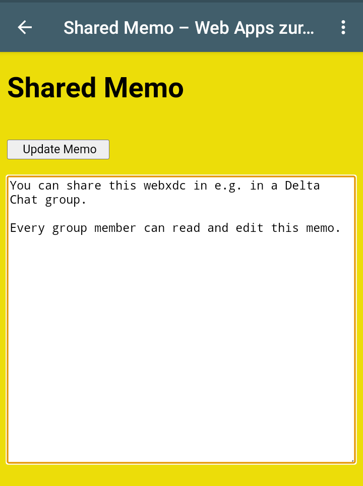

# Shared Memo

You can share this [webxdc app](https://github.com/webxdc) e.g. in a [Delta Chat](https://github.com/deltachat/) group.
Every group member can read and change this memo.
 
Use it e.g. to keep all relevant dates in one place if you plan a meeting with your friends ;-)

## Build

You have just to run "create-xdc.sh"
 
The created "Memo.xdc" can now just sent in your Delta Chat group or also in every single Chat.

## Remember
Every user have to use a Delta Chat App. Webxdc Apps works not with regular Mailclients
